# ABOUT ME

<figure><figcaption></figcaption></figure>

<figure><figcaption></figcaption></figure>

***

| 
 <code>[ CAPenX ]</code>
 | 
 <code>[ eWPTXv3 ]</code>
 | 
 <code>[ eWPTv2 ]</code>
 | 
 <code>[ eJPTv2 ]</code>
 |
| :----------------------------------------------------------------------------------------------------------------------------------: | :-----------------------------------------------------------------------------------------------------------------------------------------: | :----------------------------------------------------------------------------------------------------------------------------------------: | :----------------------------------------------------------------------------------------------------------------------------------------: |

     

***

## 💀 Owned Machines

### HackTheBox

| 
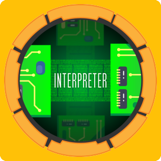 Interpreter · Medium
 | 
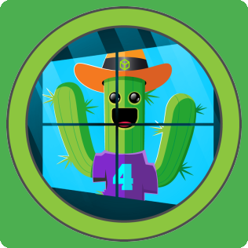 MonitorsFour · Easy
 | 
 WingData · Easy
       | 
 Giveback · Medium
   |
| -------------------------------------------------------------------------------------------- | -------------------------------------------------------------------------------------------- | ------------------------------------------------------------------------------------------ | ---------------------------------------------------------------------------------------- |
| 
 Pterodactyl · Medium
 | 
 Facts · Easy
               | 
 Browsed · Medium
       | 
 Gavel · Medium
         |
| 
 Era · Medium
                 | 
 TwoMillion · Easy
     | 
 Conversor · Easy
     | 
 Imagery · Medium
     |
| 
 Planning · Easy
         | 
 Previous · Medium
       | 
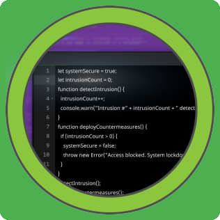 CodePartTwo · Easy
 | 
 Expressway · Easy
 |
| 
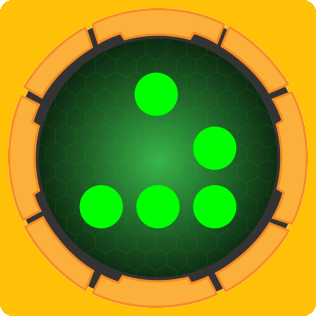 HackNet · Medium
         | 
 Soulmate · Easy
         | 
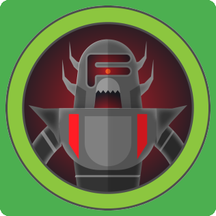 Artificial · Easy
   | 
 Cap · Easy
               |

### TryHackMe

| 
 VulnNet · Medium
                                           | 
 VulnNet: Roasted · Easy
                           | 
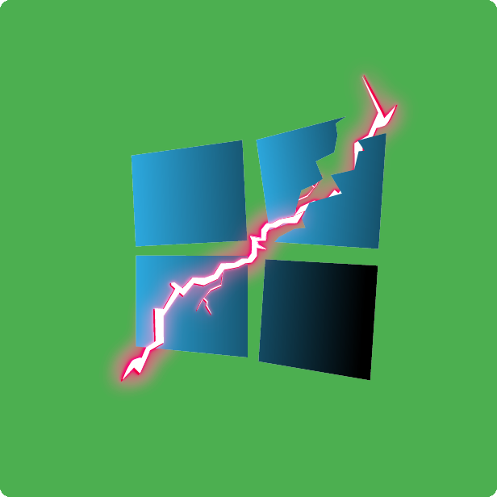 Soupedecode 01 · Easy
                           | 
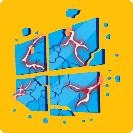 Exploiting Active Directory · Medium
 |
| ------------------------------------------------------------------------------------------------------------------------------ | ------------------------------------------------------------------------------------------------------------------------------ | -------------------------------------------------------------------------------------------------------------------------- | ---------------------------------------------------------------------------------------------------------------------------- |
| 
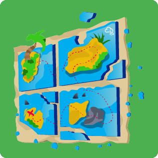 Lateral Movement and Pivoting · Easy
 | 
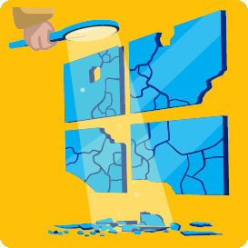 Enumerating Active Directory · Medium
 | 
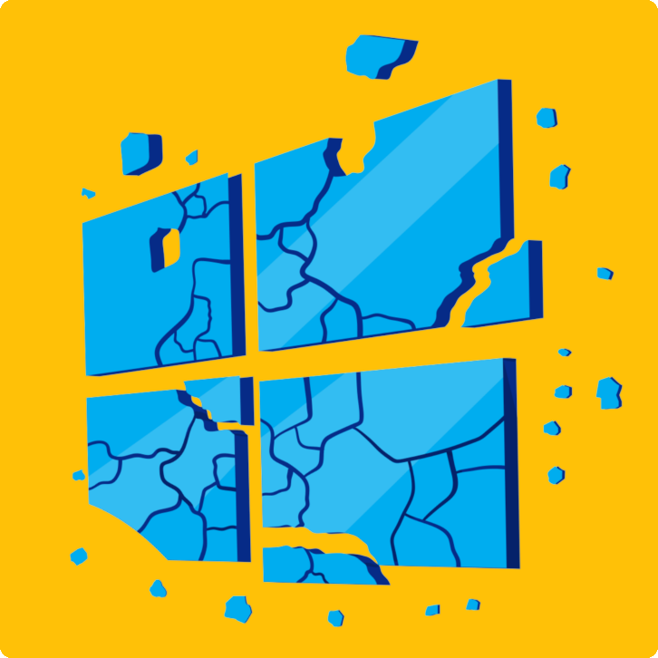 Breaching Active Directory · Medium
 | 
 Active Directory Basics · Easy
           |
| 
 Volatility Essentials · Medium
               | 
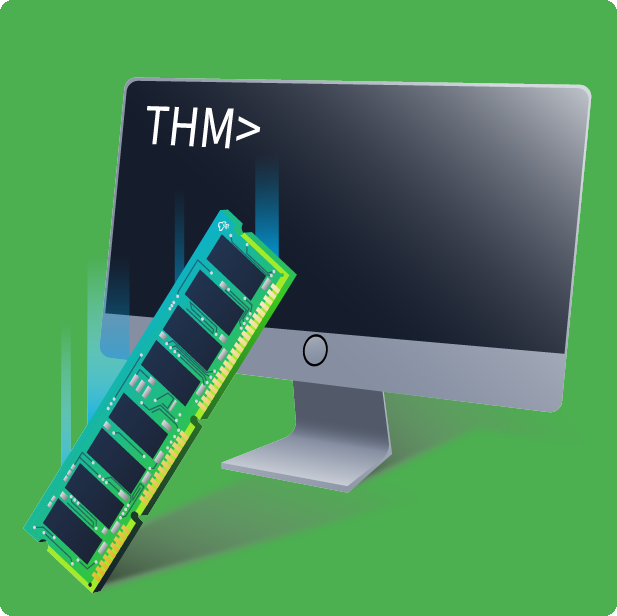 Memory Analysis Introduction · Easy
   | 
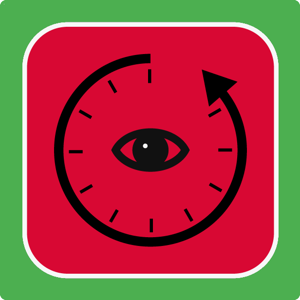 Deja Vu · Easy
                                         | 
 Poster · Easy
                                             |
| 
 Source · Easy
                                               | 
 Ice · Easy
                                                     | 
 Capture! · Easy
                                       | 
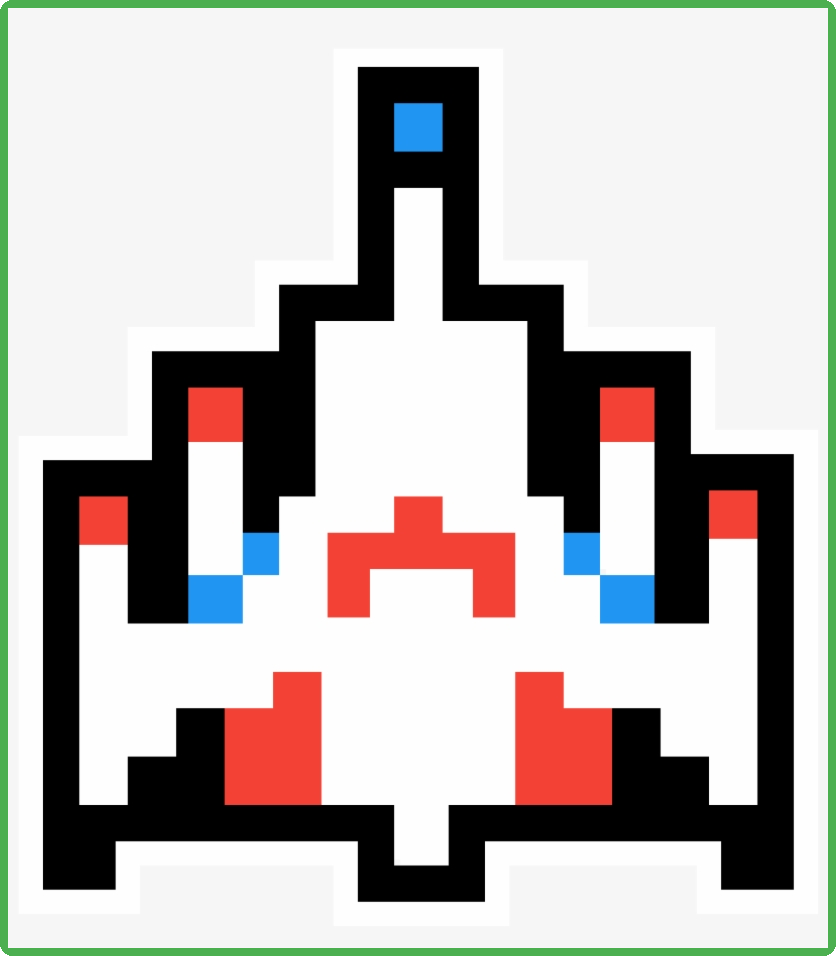 Blaster · Easy
                                           |
| 
 Basic Pentesting · Easy
                           | 
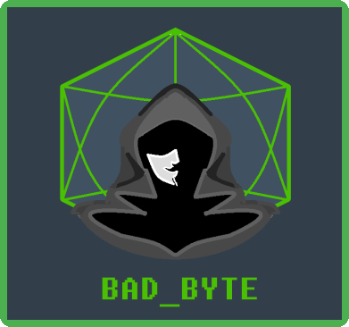 Badbyte · Easy
                                             | 
 hackerNote · Medium
                                 | 
 Mr Robot CTF · Medium
                               |
| 
 Network Services · Easy
                           | 
 Passive Reconnaissance · Easy
               | 
 Vulnversity · Easy
                                 | 
 Nmap · Easy
                                                 |
| 
 Introductory Networking · Easy
             | 
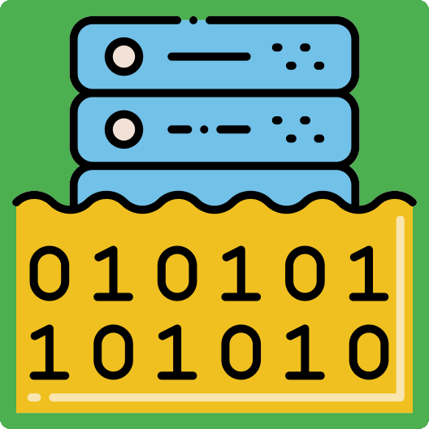 IDOR · Easy
                                                   | 
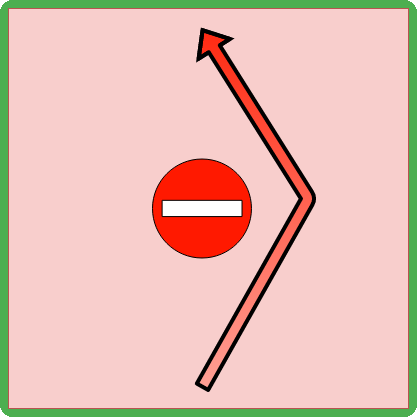 Authentication Bypass · Easy
             | 
 Subdomain Enumeration · Easy
               |
| 
 Content Discovery · Easy
                         | 
 Walking An Application · Easy
               | 
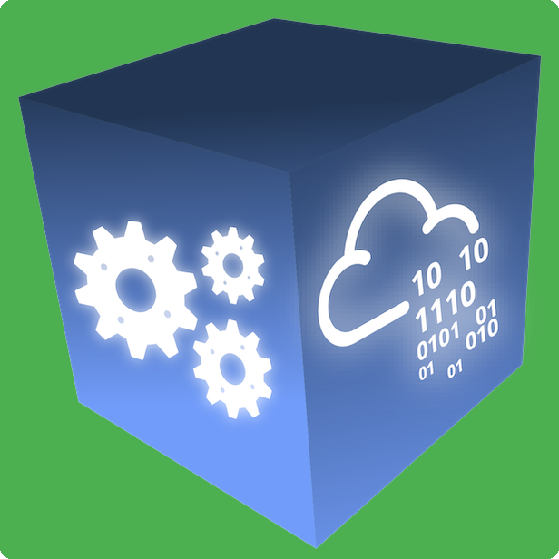 Pentesting Fundamentals · Easy
         | 
 Web Application Security · Easy
         |
| 
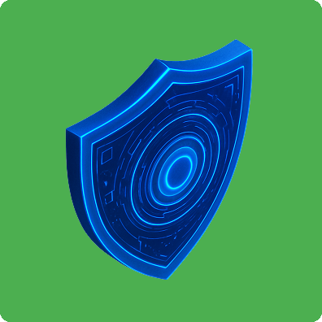 Defensive Security Intro · Easy
           | 
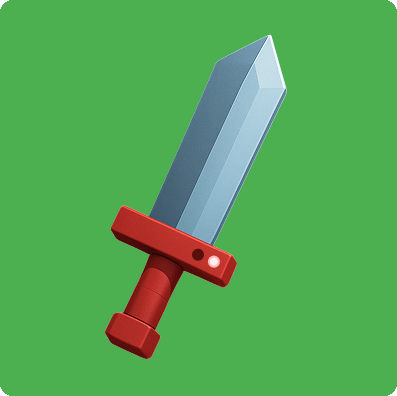 Offensive Security Intro · Easy
           | 
 DVWA · Easy
                                               |                                                                                                                              |
