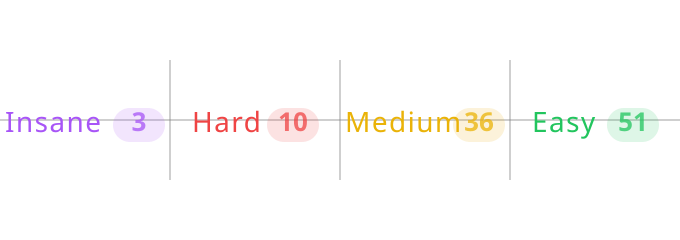

# ABOUT ME

<figure><figcaption></figcaption></figure>

|                                                                                                                                                                                 |                                                                                                                                                                                 |                                                                                                                                                                                |                                                                                                                                                                                |
| :-----------------------------------------------------------------------------------------------------------------------------------------------------------------------------: | :-----------------------------------------------------------------------------------------------------------------------------------------------------------------------------: | :----------------------------------------------------------------------------------------------------------------------------------------------------------------------------: | :----------------------------------------------------------------------------------------------------------------------------------------------------------------------------: |
| 

 <strong><code>eCPPT</code></strong>
 | 

 <strong><code>eWPTX</code></strong>
 | 

 <strong><code>eWPT</code></strong>
 | 

 <strong><code>eJPT</code></strong>
 |
|      

<strong><code>Offshore</code></strong>

<strong><code>Pro Lab</code></strong>
     |       

<strong><code>Dante</code></strong>

<strong><code>Pro Lab</code></strong>
       |                                                                                                                                                                                |          

<strong><code>Certified AppSec Pentesting eXpert (CAPenX)</code></strong>
         |
|                                                                                                                                                                                 |                                                                                                                                                                                 |                                                                                                                                                                                |                                                                                                                                                                                |

     

***

<!-- OWNED_SECTION_START -->
## 🗡️ Owned Machines

**HackTheBox**

Last updated: 2026-08-24 20:23 KSA

<!-- OWNED_SECTION_END -->
