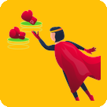
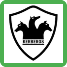
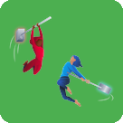
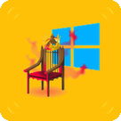

# ABOUT ME

<figure>

</figure>

<figure>

</figure>

| 
 <code>[CAPenX]</code>
 | 
 <code>[eWPTXv3]</code>
 | 
 <code>[eWPTv2]</code>
 | 
 <code>[eJPTv2]</code>
 |
| :----------------------------------------------------------------------------------------------------------------------------------: | :-----------------------------------------------------------------------------------------------------------------------------------------: | :----------------------------------------------------------------------------------------------------------------------------------------: | :----------------------------------------------------------------------------------------------------------------------------------------: |

     

***

<!-- OWNED_SECTION_START -->
## 🗡️ Owned Machines

### HackTheBox

| 
 
<b>CCTV</b>

 | 
 
<b>Pirate</b>

 | 
 
<b>Eighteen</b>

 | 
 
<b>Interpreter</b>

 |
| --- | --- | --- | --- |
| 
 
<b>MonitorsFour</b>

 | 
 
<b>WingData</b>

 | 
 
<b>Giveback</b>

 | 
 
<b>Pterodactyl</b>

 |
| 
 
<b>Facts</b>

 | 
 
<b>Browsed</b>

 | 
 
<b>Gavel</b>

 | 
 
<b>Era</b>

 |
| 
 
<b>TwoMillion</b>

 | 
 
<b>Conversor</b>

 | 
 
<b>Imagery</b>

 | 
 
<b>Planning</b>

 |
| 
 
<b>Previous</b>

 | 
 
<b>CodePartTwo</b>

 | 
 
<b>Expressway</b>

 | 
 
<b>HackNet</b>

 |
| 
 
<b>Soulmate</b>

 | 
 
<b>Artificial</b>

 | 
 
<b>Cap</b>

 |

### TryHackMe

| 
 
<b>CVE-2022-26923</b>

 | 
 
<b>Ledger</b>

 | 
 
<b>AVenger</b>

 | 
 
<b>Enterprise</b>

 |
| --- | --- | --- | --- |
| 
 
<b>Attacking Kerberos</b>

 | 
 
<b>Red</b>

 | 
 
<b>Services</b>

 | 
 
<b>Volatility Essentials</b>

 |
| 
 
<b>AD: BadSuccessor</b>

 | 
 
<b>Memory Analysis Introduction</b>

 | 
 
<b>Soupedecode 01</b>

 | 
 
<b>Lookback</b>

 |
| 
 
<b>Capture!</b>

 | 
 
<b>Active Directory Basics</b>

 | 
 
<b>Defensive Security Intro</b>

 | 
 
<b>Exploiting Active Directory</b>

 |
| 
 
<b>Lateral Movement and Pivoting</b>

 | 
 
<b>Web Application Security</b>

 | 
 
<b>Offensive Security Intro</b>

 | 
 
<b>Enumerating Active Directory</b>

 |
| 
 
<b>Breaching Active Directory</b>

 | 
 
<b>IDOR</b>

 | 
 
<b>Passive Reconnaissance</b>

 | 
 
<b>Authentication Bypass</b>

 |
| 
 
<b>Subdomain Enumeration</b>

 | 
 
<b>Content Discovery</b>

 | 
 
<b>Pentesting Fundamentals</b>

 | 
 
<b>Walking An Application</b>

 |
| 
 
<b>Deja Vu</b>

 | 
 
<b>VulnNet: Roasted</b>

 | 
 
<b>VulnNet</b>

 | 
 
<b>Badbyte</b>

 |
| 
 
<b>Nmap</b>

 | 
 
<b>Poster</b>

 | 
 
<b>Source</b>

 | 
 
<b>Blaster</b>

 |
| 
 
<b>Network Services</b>

 | 
 
<b>Introductory Networking</b>

 | 
 
<b>hackerNote</b>

 | 
 
<b>Attacktive Directory</b>

 |
| 
 
<b>Ice</b>

 | 
 
<b>DVWA</b>

 | 
 
<b>Vulnversity</b>

 | 
 
<b>Basic Pentesting</b>

 |
| 
 
<b>Mr Robot CTF</b>

 |

<!-- OWNED_SECTION_END -->
