# ABOUT ME

<figure><figcaption></figcaption></figure>

<figure><figcaption></figcaption></figure>

***

| 
 <code>[ CAPenX ]</code>
 | 
 <code>[ eWPTXv3 ]</code>
 | 
 <code>[ eWPTv2 ]</code>
 | 
 <code>[ eJPTv2 ]</code>
 |
| :----------------------------------------------------------------------------------------------------------------------------------: | :-----------------------------------------------------------------------------------------------------------------------------------------: | :----------------------------------------------------------------------------------------------------------------------------------------: | :----------------------------------------------------------------------------------------------------------------------------------------: |

     

---------------------------------------------------------------------
<!-- OWNED_SECTION_START -->
## 💀 Owned Machines

### HackTheBox

| 
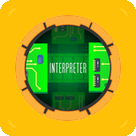 Interpreter · Medium
 | 
 MonitorsFour · Easy
 | 
 WingData · Easy
 | 
 Giveback · Medium
 |
| --- | --- | --- | --- |
| 
 Pterodactyl · Medium
 | 
 Facts · Easy
 | 
 Browsed · Medium
 | 
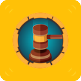 Gavel · Medium
 |
| 
 Era · Medium
 | 
 TwoMillion · Easy
 | 
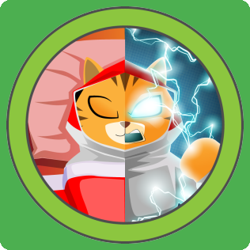 Conversor · Easy
 | 
 Imagery · Medium
 |
| 
 Planning · Easy
 | 
 Previous · Medium
 | 
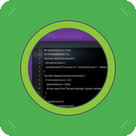 CodePartTwo · Easy
 | 
 Expressway · Easy
 |
| 
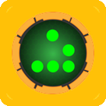 HackNet · Medium
 | 
 Soulmate · Easy
 | 
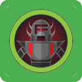 Artificial · Easy
 | 
 Cap · Easy
 |

### TryHackMe

| 
 VulnNet · Medium
 | 
 VulnNet: Roasted · Easy
 | 
 Soupedecode 01 · Easy
 | 
 Exploiting Active Directory · Medium
 |
| --- | --- | --- | --- |
| 
 Lateral Movement and Pivoting · Easy
 | 
 Enumerating Active Directory · Medium
 | 
 Breaching Active Directory · Medium
 | 
 Active Directory Basics · Easy
 |
| 
 Volatility Essentials · Medium
 | 
 Memory Analysis Introduction · Easy
 | 
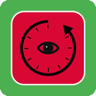 Deja Vu · Easy
 | 
 Poster · Easy
 |
| 
 Source · Easy
 | 
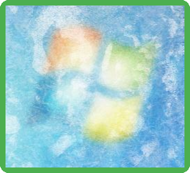 Ice · Easy
 | 
 Capture! · Easy
 | 
 Blaster · Easy
 |
| 
 Basic Pentesting · Easy
 | 
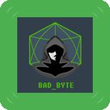 Badbyte · Easy
 | 
 hackerNote · Medium
 | 
 Mr Robot CTF · Medium
 |
| 
 Network Services · Easy
 | 
 Passive Reconnaissance · Easy
 | 
 Vulnversity · Easy
 | 
 Nmap · Easy
 |
| 
 Introductory Networking · Easy
 | 
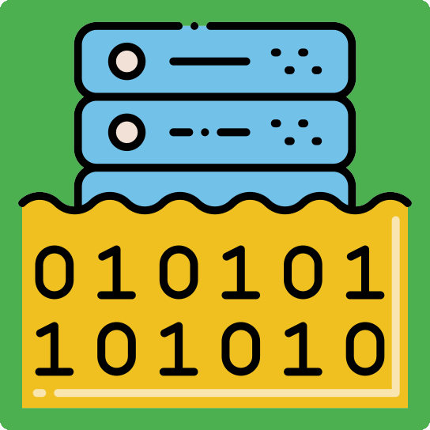 IDOR · Easy
 | 
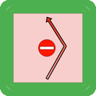 Authentication Bypass · Easy
 | 
 Subdomain Enumeration · Easy
 |
| 
 Content Discovery · Easy
 | 
 Walking An Application · Easy
 | 
 Principles of Security · Info
 | 
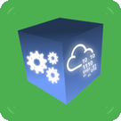 Pentesting Fundamentals · Easy
 |
| 
 Web Application Security · Easy
 | 
 Careers in Cyber · Info
 | 
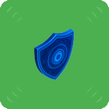 Defensive Security Intro · Easy
 | 
 Offensive Security Intro · Easy
 |
| 
 DVWA · Easy
 |

<!-- OWNED_SECTION_END -->
